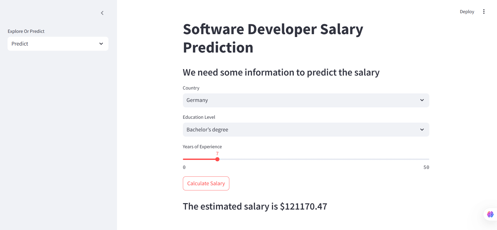
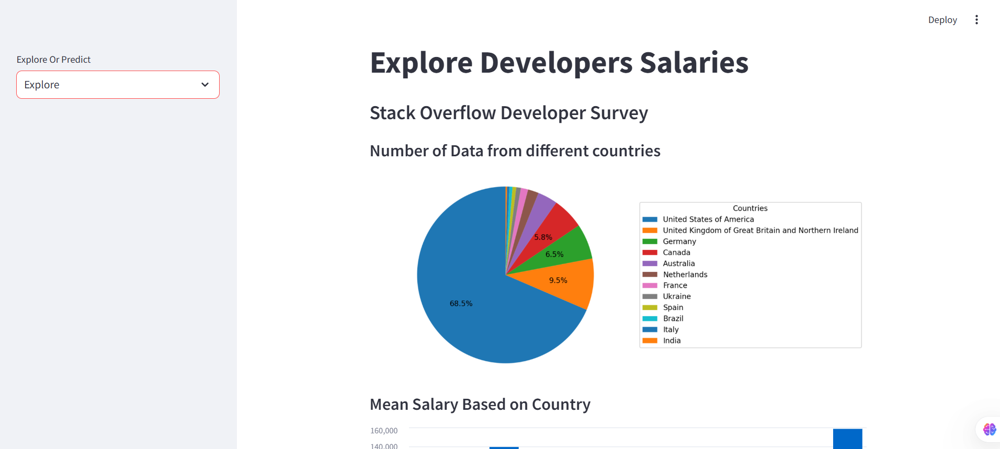
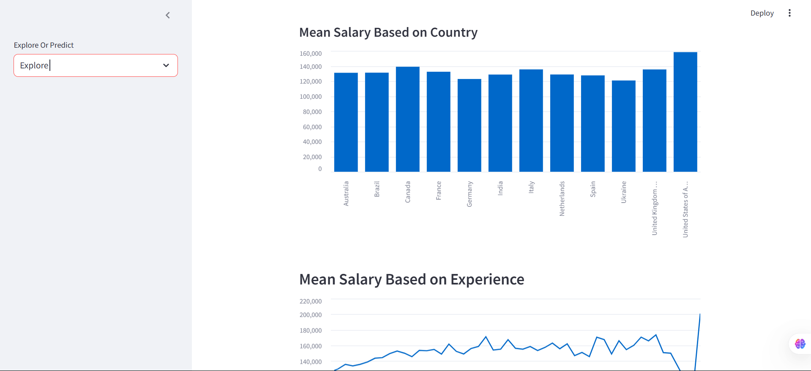

# 2024-Software-Developer-Salary-Prediction

Based on 2024 dataset, which was the survey conducted by Stackoverflow to collect salary of diverse developers was used to build this model to predict the salary of developers based on their `Country`, `Qualification` category (Bachelors degree, PhD, etc) and `Years of Experience`. 

  
  
  

